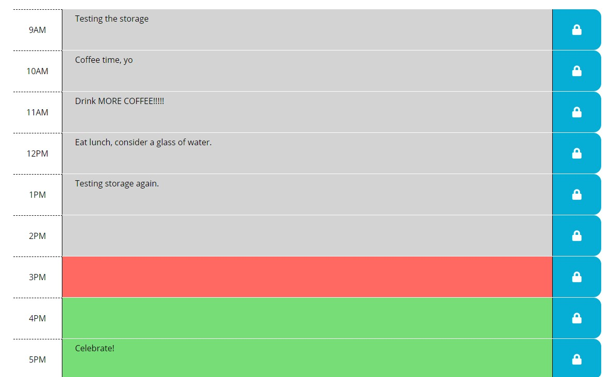

# 05_WorkDayScheduler
## Homework #5

### About the Project

In this homework, we were tasked with creating a daily planner that scheduled a basic work day - from 9-5.  The planner needed to receive input from the user and save the content when the save button is pressed.  The schedule blocks will also respond to the time of the day representing current, past, and future events.  

[Link to website](https://cjlaflamme1.github.io/05_WorkDayScheduler/)

---
### Biggest Challenges

1. My first big learning was trying to use Bootstrap and flexbox to organized the content of the webpage as displayed in the example.  It was surprisingly difficult to get content justified and centered, but I learned a lot about flexbox in the process. 

2. Another encounter was with trying to compare time with the specific schedule time blocks.  First I had to find how to reduce the time variable to just the hour, then compare that with the value of the block.  A bug almost slipped through (again) where I didn't realize it was trying to compare an integer and a string, so I had to parseInt each piece to prevent issues.  

---
### Screen Shots

